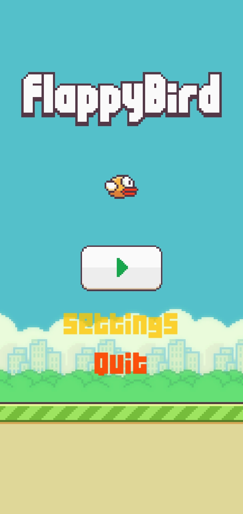
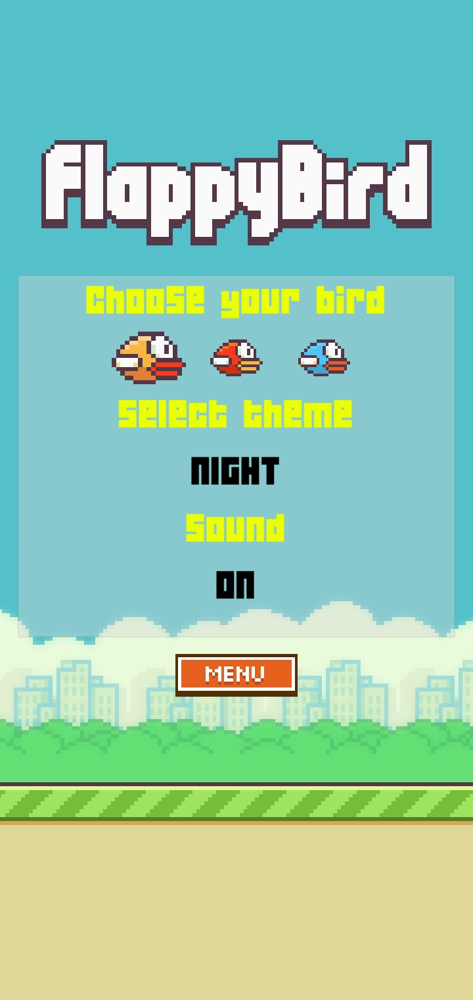
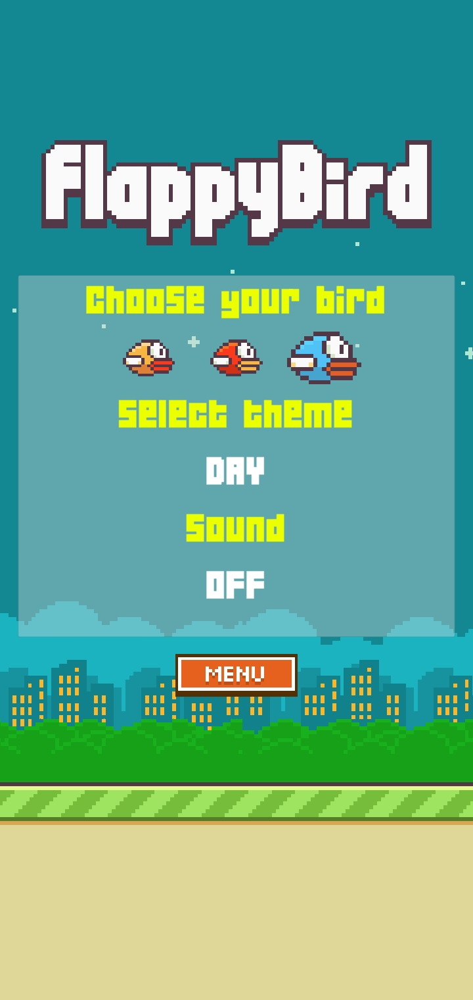
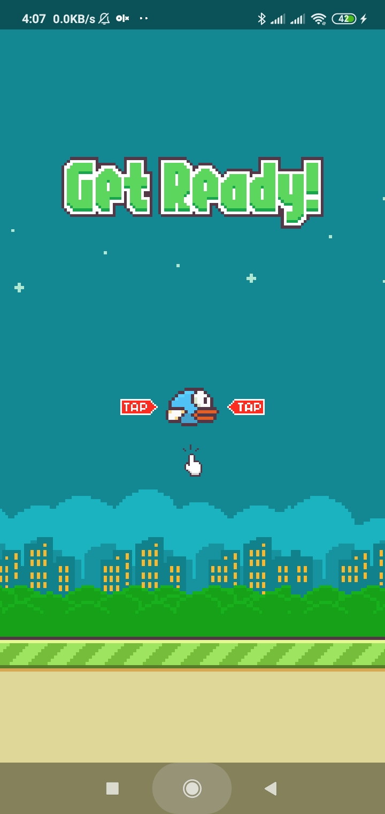
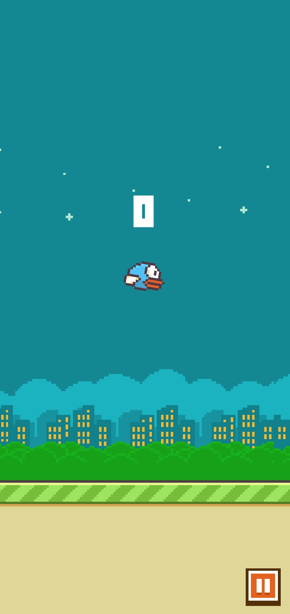
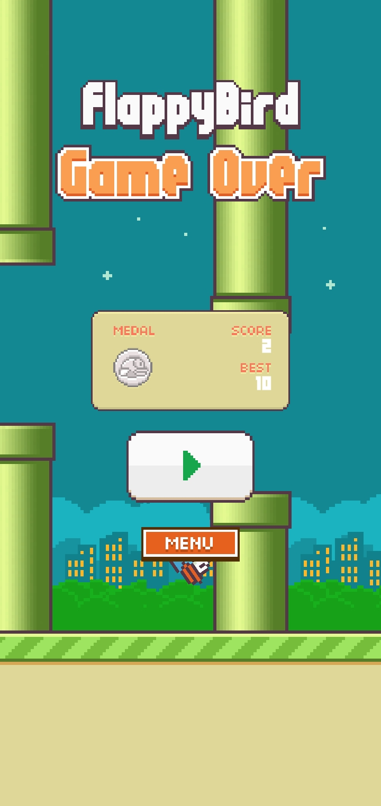

# Flappy Bird
Fancy clone of a very famous game Flappy Bird. Enjoy playing and try not to get mad!

## Table of Contents
* [General Info](#general-information)
* [Features](#features)
* [Screenshots](#screenshots)
* [Project Status](#project-status)
* [Contact](#contact)

## General Information
The application was made using Unity 2019.4.13 and C# programing language.

## Features
- All your record are save in the device`s local storage
- Change bird skin, background theme and sound setting on settings 

## Screenshots

<!-- If you have screenshots you'd like to share, include them here. -->

## Project Status
Project is complete.

## Contact
Created by excitenew@gmail.com - feel free to contact me!